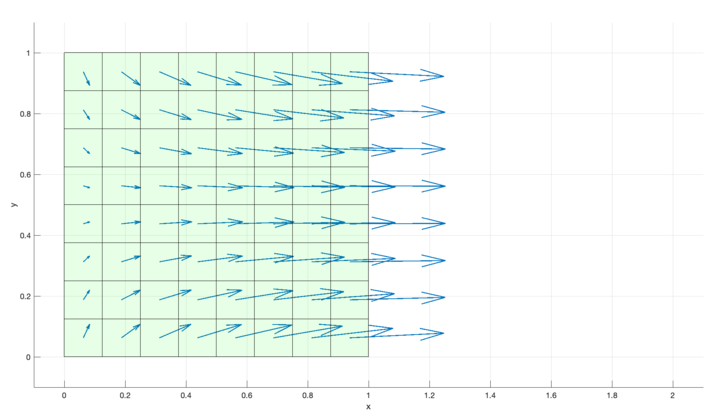

### nFVM - nano Finite Volume Method: A general FVM solid solver for MATLAB ###

Author: Lucas Ribeiro de Azevedo (FNB at TU-Darmstadt/Germany)

### Description ###

   The solver is a powerful tool to experiment new discretization  
approaches, constitutive material equations, boundary conditions and much  
more. As far as I am aware, this is the first general solid solver for  
MATLAB based on the FVM framework. The solver complements the toolbox  
solids4foam[Cardiff - 2018] since the idea is to experiment something new  
with nFVM and, once satisfied with the results, one can implement the same  
new approach in the high-performance solids4foam solver.  
   It borrows some approaches from uFVM and the book [Moukalled - 2015]  
was very important to implement the nFVM. The solver compromises  
performance in order to keep it very simple and readable.  
   The code uses the rapid development approach. We solve a problem, then  
we try to find a generalization and, finally, we apply code refactoring.  
For this reason, it is easy to face code that clearly needs refactoring.  
Feel free to contribute.  

### Updates ###
 + 0.5.2
    - Added the glabal variable VECTORIZE to turn on vectorization of the code;  
    - Removed subsref and subsasign function from field classes. They  
      were really slowing down code the code.

### Features ###

 + Uses MATLAB and class-oriented approach to create a solver which is:  
    - Not complicated to Experiment new algorithms/models.  
    - Intuitive to use for new users;  
    - Easy to understand at the case and code level;  
    - Straightforward to maintain;  
    - Uncomplicated to extend;  
 + Supported boundary conditions:  
    - Dirichlet as fixed displacement (fixedDisplacementPatchVectorField.m);  
    - Neumann as solid traction (solidTractionPatchVectorField.m);  
    - Symmetry (dirichlet and Neumann, see solidSymmetryPatchVectorField.m);  
    - Empty. This is to allow 2d/1d simulation (emptyPatchVectorField.m);  
    - Contact with a moving sphere (rigidSphereContactPatchVectorField.m).  
      The ImpactOnBrick case uses it.  
 + Very lightweight  
    - It can be used right away. No compilation is needed.  
 + Implicit cell-centred FVM  
 + Heavily inspired by uFVM, solids4Foam and foam-extend/openFOAM  
 + Verified using cases having analytical solution  
 + Uses TLTD (Total Lagrangian Total Displacement) approach  
 + Has a block coupled solver [Cardiff - 2016].
 + Has a non-linear block coupled solver [Cardiff - 2016].
 + It supports skewed and non-conformal meshes.  
 + Supports Patankar's implicit under-relaxation method  
    [p. 150, Moukalled - 2015; eq. 3.56, Muzaferija - 1994].  
 + Static and transient cases (see PrismaticBar and Shear cases  
   respectively).  
 + It has support to openFOAM's mesh format (then it supports all meshes  
   which are convertible to openFOAM).  
 + Instead of array of doubles, it uses the high level concept of fields.  
 + The knowledge about openFOAM/solids4foam is used in nFVM, many  
   concepts are related among them. So if you know openFOAM/solids4foam  
   it is pretty straightforward to use nFVM.  
 + Supported linear solvers: AMG, ICCG, Gauss-Seidel and Direct.  
 + Supported gradient computations: Gauss-Green and Least-Square.  
 + Constitutive solid equations:  
    - BlatzKo, Duhamel-Neumann, Hookean, neo-Hookean and Ogden.  
 + Has non-orthogonal correction (overrelaxed approach).  
 + Handles anisotropic diffusion [Darwish - 2009].  
 + It is modular and can be used a continuum mechanics tool. For example,  
   given a surfaceTensorField S one can calculate the divergent(S)  
   (using the function fvc_div()) and plot it without having the program  
   running.  
 + Has a UML diagram (inside docs/ folder) to describes the software (I  
 have created using www.draw.io).  

### Verification of the software ###
Is the software implementation correct? To answer this, five test cases  
were used. All four cases from [Demirdi - 1994] and the first case from  
[Cardiff - 2018]. There will be more soon.  

### Some MATLAB features ###
MATLAB is very powerful when it comes to prototyping. It follows some  
features:  
+ High-level language when compared to C++;  
+ Change a function implementation at runtime;  
+ Run just a block of code;  
+ High-level inspection of variables;  
+ A big number of numerical tools available;  
+ Plot data during runtime;  
+ The main type is an array of doubles;  
+ Pause run. This opens a big number of possibilities of investigation;  
+ Use of tic/toc to measure performance;  

### Install AMG (Algebraic Multigrid Solver) solver (optional) ###
This is the only thing that needed to be compiled in order to use this  
particular linear solver.  
1. Open MATLAB.  
2. Navigate to nFVM/thirdParty/MATAMG.  
3. Type in the MATLAB's console  
`install`  
4. To verify the installation, go to example folder and run the `ex01  

### How to run some cases ###

1. Get a copy of nFVM.tar.gz and extract it (e.g. Linux\MacOS:  
`tar -xvf nFVM.tar.gz`).  
2. Open MATLAB, then navigate to the extracted folder.  
3. Once the MATLAB is open type in the console:  
`load_nFVM`  
4. To run a case, navigate to the a case folder, e.g.  
`cd problems/+azevedo/@Uniaxial2d/defaultCase`  
5. Open the runCase.m script and run it   
6. Alternatively, type:   
`params = [];`  
`params.solidModel = 'Segregated';`  
`params.Lambda = 1.3;`  
`pathToMesh = '../meshes/unitCube8x8/';`  
`problem = azevedo.Uniaxial2d(pathToMesh, params);`  
`problem.solve();`  

### Nomenclature ###

 - MMS = Method Of Manufactured Solution  
 - Element/vol = (A finite volume) polyhedron. When used as a prefix is  
   suggests the computation/value is related to the polyhedron's centroid.  
 - Face/surface = The face of the polyhedron. Analogous to the above.  
 - Phi/u = the main unknown variable  
 - Grad = As in surfaceGradU variable stands for the gradient of U ( in  
   this case at the face.  
 - iFace = The index of the ith face (iElement is analogous).  
 - phiHandle = The analytical (or numerical) function definition, just  
   like stressHandle.  
 - Tensor = A 2nd order Tensor, in particular 3x3 matrix.  
 - nDivisions = The n prefix implies the understanding: number of  
   divisions.  

### Todo ###
- Least-square gradient computation method only works for 3D cases.    
- Save the fields to the disk every time step, just like openFOAM.  
- The method a_scalarField.internalField(...) should always return a  
scalarField (and the analogous to other fields). Today it is returning  
plain data.  
- Refactor functions fvc_laplacian/fvc_div.  
- Choose a license.  
- Create a common base class patchField for all patch*Fields to remove  
duplicated code.  
- Use sparse matrix! Please!  
- Optimize the code use MATLAB's profiler.  
- The functions fvc_laplacian* are very similar. They should be refactored.  
- The linear solver functions should be converted to classes.  
- Implement bTensorField.identity().  
- MechanicalModel.computeSurfaceGradU() is not being used.  
- Port fvc_laplacianTrace and fvc_laplacianTranspose to the new version  
- volU_o and volU_oo must be stores inside volU.  
- Implement the {scalar,vector,tensor}Field in c++ and let the user  
choose whether to use it or not (since a compilation would be required).  
- And many more things ...  

### Credits ###

1. I have used the files  
    fvmProcessOpenFoamMesh.m and fvmReadOpenFoamMesh.m  
from uFVM to be able to parse openFOAM mesh format.  
3. I am using the algebraic multigrid toolbox called MATAMG from Minho  
Park (https://github.com/parkmh/MATAMG).  
4. solids4foam was by far the most inspiring source for my work.  
5. OpenFOAM was also a source of inspiration.  
6. The book "The finite volume method in computational fluid dynamics:  
an advanced introduction - Moukalled - 2015" was the primary book used to  
implement nFVM.  
7. CNPQ - Science without borders.  
8. FNB - TU-darmstadt (www.fnb.tu-darmstadt.de).  
9. GSC - TU-darmstadt (www.graduate-school-ce.de).  

### Some images from simulations ###
#### Simply supported beam ####
{height=220}  

#### Supported beam ####
{height=220}  

#### Elongation of an unit cube ####
{height=220}  

#### Compression of an unit cube ####
{height=220}  

#### Shearing an unit cube ####
{height=220}  

#### Rigid sphere impacting on a brick made of cork (1/4 symmetry) ####
{height=220}  

#### PlateHole case ####
{height=220}  

#### Displacement geometric field ####
{height=220}  

#### Elongation ####
{height=220}  

### Known bugs ###
+ Meshes converted from Ansys have the face normals flipped.  
+ Least-Square gradient calculation is implemented only for 3d.

### Reference ###

  [Demirdi - 1994] - Finite volume method for stress analysis in complex
        domains.  
  [Demirdzic - 1994] - Numerical method for coupled fluid flow, Heat  
        transfer and stress analysis using unstructured moving meshes  
        with cells of arbitrary topology.  
  [Muzaferija - 1994] - Adaptive finite volume method for flow prediction  
        using unstructured meshes and multigrid approach.  
  [Weller - 1998] - A tensorial approach to computational continuum  
        mechanics using object-oriented techniques.  
  [Maneeratana - 2000] - Development of the finite volume method for  
        non-linear structural applications.  
  [MMS - 2007] - http://imechanica.org/node/1357#Batra97  
  [Darwish - 2009] - A Compact Procedure for Discretization of the  
        Anisotropic Diffusion Operator.  
  [Moukalled - 2015] - The finite volume method in computational fluid  
        dynamics: an advanced introduction.  
  [Cardiff - 2016] - A block-coupled Finite Volume methodology for linear
        elasticity and unstructured meshes.  
  [Darwish - 2017] - General fully implicit discretization of the  
        diffusion term for the finite volume method.  
  [Cardiff - 2018] - An open-source finite volume toolbox for solid  
        mechanics and fluid-solid interaction simulations.  
